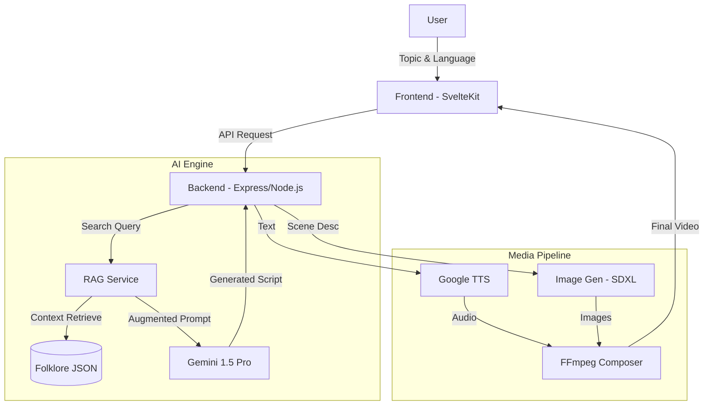

# Lokkatha AI 🎭

**Lokkatha AI** is an advanced **Agentic AI Platform** designed to preserve and revitalize folklore through hyper-localized educational videos. It leverages **Retrieval-Augmented Generation (RAG)** and **Large Language Models (Gemini)** to generate culturally accurate scripts, which are then transformed into multimedia experiences using Text-to-Speech (TTS) and Image Generation.

## 🚀 Key Features

*   **🧠 AI-Powered Storytelling (RAG)**: Uses a Retrieval-Augmented Generation engine to ground AI responses in authentic folklore data, ensuring cultural accuracy.
*   **🗣️ Hyper-Localization**: Supports multiple Indian languages (Hindi, Tamil, Telugu, Marathi, Bengali) with dialect-specific nuances.
*   **🌐 End-to-End Video Generation**: Automates the pipeline from *Topic* -> *Script* -> *Visuals* -> *Audio* -> *Video*.
*   **📱 Modern Web App**: Built with SvelteKit for a responsive, app-like experience on mobile and desktop.

## 🏗️ System Architecture

The system follows a modular microservices-like architecture:



## 🛠️ Technical Deep Dive

### 1. RAG Engine & AI Workflow
The core of Lokkatha is its **RAG Service** (`backend/src/services/rag.service.ts`). instead of hallucinating stories, the AI:
1.  **Retrieves**: Searches the internal folklore database using a TF-IDF inspired algorithm (Keyword + Theme matching).
2.  **Augments**: Injects relevant cultural context (moral, characters, region) into the System Prompt.
3.  **Generates**: The LLM (Gemini) uses this context to write a script that feels authentically local.

### 2. Localization (i18n) Strategy
We treat language as a first-class citizen across the stack:
*   **Frontend**: Uses a reactive Svelte store (`src/lib/i18n/translations.ts`) for instant UI language switching without page reloads.
*   **Backend**: The `gemini.service.ts` uses dynamic prompt engineering to force the LLM to adopt specific dialects and cultural tones (e.g., formal Hindi vs. colloquial Marathi).

## 📂 Project Structure

- **`frontend/`**: SvelteKit application.
  - `src/lib/i18n/`: Localization logic.
  - `src/lib/components/`: Reusable UI components (Camera, Audio, Video).
- **`backend/`**: Node.js API.
  - `src/services/rag.service.ts`: Context retrieval engine.
  - `src/services/gemini.service.ts`: LLM integration.


## ⚡ Quick Start

1.  **Prerequisites**: Node.js 18+, FFmpeg, and a Gemini API Key.
2.  **Setup**:
    ```bash
    # See docs/SETUP_GUIDE.md for details
    cd backend && npm install
    cd frontend && npm install
    ```
3.  **Run**:
    ```bash
    # Terminal 1
    cd backend && npm run dev
    # Terminal 2
    cd frontend && npm run dev
    ```


## 👤 Author

**Dayanand Darpan**

[](https://dayananddarpan.me)
[](https://linkedin.com/in/dayanand-darpan)
[](https://github.com/dayanandXdarpan)

📧 **Email**: dayanand.darpan@gmail.com  
📱 **Phone**: +91 8709590188

---

## License

MIT License © 2024 Dayanand Darpan. Built for the Vaishali Visionaries Hackathon.
